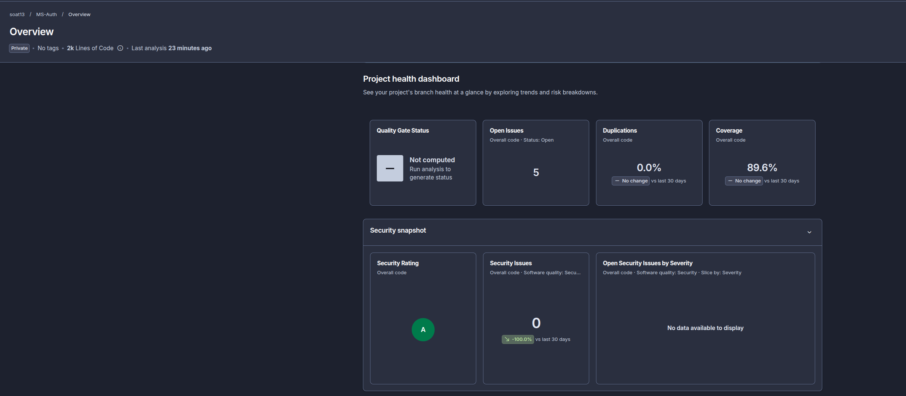

# Oficina Auth Service

## Sobre o Projeto

Microserviço responsável pela autenticação e gestão de usuários do sistema Oficina. Ele gerencia o ciclo de vida de usuários, atribuição de perfis (RBAC) e emissão de tokens JWT para proteção das APIs do ecossistema.

### Links Úteis

- GitHub: https://github.com/soat13/oficina
- Miro: https://miro.com/app/board/uXjVJLyIcr8=

### Funcionalidades Principais

- **Gestão de Usuários** — Cadastro, atualização e remoção de usuários com validação de documentos (CPF/CNPJ).
- **Controle de Acesso (RBAC)** — Gestão de perfis e permissões (Atendente, Mecânico, Gerente, Admin).
- **Autenticação** — Login seguro com validação de credenciais e geração de tokens JWT.
- **Integração com DynamoDB** — Armazenamento escalável e de baixa latência para dados de usuários.

A aplicação segue os princípios de **Domain-Driven Design (DDD)** e **Arquitetura Hexagonal**.

## Fluxos de Autenticação

Os fluxos de autenticação (Login) e gestão de usuários (CRUD) seguem os padrões definidos na especificação OpenAPI. Detalhes de implementação, como a geração de tokens JWT e persistência no DynamoDB, podem ser encontrados na seção de **Aspectos Técnicos**.

> Payloads, schemas e exemplos de request/response estão documentados no **Swagger/OpenAPI**.


## Documentação Técnica

- Arquitetura e decisões técnicas: [OpenAPI Spec](assets/docs/openapi.yaml)

## Aspectos Técnicos

A API é construída em **Go**, seguindo princípios de **DDD** e **Arquitetura Hexagonal**, organizada por contextos de domínio independentes.

### Arquitetura

O projeto adota **Arquitetura Hexagonal (Ports & Adapters)** combinada com **DDD**, organizado por contextos de domínio independentes.

Cada contexto é estruturado em:

- **Domain** (`domain/`) — Entidades, value objects e regras de negócio puras, sem dependências externas
- **Application** (`application/`) — Casos de uso que representam as operações do sistema (pontos de entrada) e ports (interfaces) para dependências externas
- **Infrastructure** (`infra/`) — Adapters concretos:
    - **Inbound**: handlers HTTP (Fiber) e middleware JWT.
    - **Outbound**: repositórios (**DynamoDB**), geração de tokens (**JWT**) e hash de senhas (**Bcrypt**).

Os casos de uso são invocados por adapters de entrada e acessam recursos externos exclusivamente via **ports**, garantindo baixo acoplamento e inversão de dependência.

### Stack Tecnológica

- **Linguagem**: Go 1.25.1
- **Framework HTTP**: Fiber v2
- **Banco de Dados**: **Amazon DynamoDB** — Escolhido pela alta escalabilidade, baixa latência e modelo de dados flexível. No ambiente local, utilizamos o `dynamodb-local`.
- **SDK**: AWS SDK for Go v2
- **Autenticação**: JWT (HS256)
- **Testes**: Go testing + testify (Integração com DynamoDB Local)
- **Containerização**: Docker + Docker Compose (DynamoDB Local)

## Requisitos

- Docker e Docker Compose
- make (opcional, recomendado)

## Pipeline

O projeto utiliza **GitHub Actions** para CI/CD automatizado com os seguintes jobs:

```
┌─────────────────────────────────────────────────────────────────────────────────────────────┐
│                      GitHub Actions - Aplicação (oficina)                                   │
│                                                                                             │
│  ┌──────────────┐    ┌──────────────┐    ┌──────────────┐    ┌──────────────┐               │
│  │   SonarCloud │──▶│     Build    │───▶│     Push     │──▶│   Deploy     │               │
│  │     Scan     │    │    Docker    │    │     ECR      │    │   K8s/EKS    │               │
│  └──────────────┘    └──────────────┘    └──────────────┘    └──────────────┘               │
│   • Security           • Tests              • Tag Image         • Apply Manifests           │
│   • Code Quality       • Coverage           • Amazon ECR        • Rolling Update            │
└─────────────────────────────────────────────────────────────────────────────────────────────┘
```
1. **tests-and-quality** — Testes unitários/integração + SonarCloud
2. **docker-build** — Build da imagem Docker
3. **deploy-to-ecr** — Push para Amazon ECR (apenas branch `main`)
4. **k8s-deploy** — Deploy automático no Kubernetes (EKS) aplicando os manifests localizados em `deploy/k8s/` (apenas branch `main`)
   - Obtém outputs do Terraform do estado armazenado no S3
   - Configura kubectl para conectar ao cluster EKS
   - Aplica todos os recursos Kubernetes necessários
   - Executa rolling update do deployment

## Executando o Projeto local

### Com Make

1. Subir os containers:
    - `make install`
    - Caso não exista `.env`, ele será criado a partir do `.env-example`.
2. Provisionar o Banco de Dados (DynamoDB):
    - `make aws-create-table` (Cria a tabela `users`)
    - `make aws-seed-user` (Cria um usuário admin de teste: `58457673009` / `TestPass123!`)
3. Rodar a API:
    - `make run`

### Sem Make

1. Criar o `.env` a partir do `.env-example`.
2. Subir os containers:
    - `docker compose up -d`
3. Provisionar o Banco de Dados:
    - `./scripts/aws/create-dynamodb-table.sh --endpoint http://localhost:8000`
    - `./scripts/aws/seed-test-user.sh --endpoint http://localhost:8000`
4. Rodar a API:
    - `docker compose exec app-dev go run ./cmd/api`

## Swagger / OpenAPI

- UI: http://localhost:8080/docs
- Spec: http://localhost:8080/openapi.yaml
- Arquivo no repositório: `assets/docs/openapi.yaml`

## Autenticação

A API utiliza **JWT** para proteger as rotas administrativas (`/admin/**`).

- Login: `POST /auth/login`
- Header: `Authorization: Bearer <token>`

## Testes

- `make test` — executa testes unitários e de integração (usa DynamoDB Local)
- `make aws-integration-test` — executa teste de integração específico para o adapter DynamoDB
- `make test-coverage` — gera relatório de cobertura
- `make sonar` — executa análise no SonarQube

> Os testes de integração utilizam o DynamoDB Local com a flag `-sharedDb` para garantir consistência de dados entre os diferentes Access Keys.

## Last Sonar Overview:


## Deploy no Kubernetes

A aplicação é deployada automaticamente no **Amazon EKS** através do pipeline CI/CD. Os manifests Kubernetes estão localizados em `deploy/k8s/`:

### Manifests Disponíveis

- **namespace.yaml** — Cria o namespace `fiap` para isolamento dos recursos
- **serviceaccount.yaml** — Service account para o pod da aplicação
- **configmap.yaml** — Configurações não sensíveis (MIGRATIONS_DIR, PORT)
- **secrets.yaml** — Dados sensíveis (JWT_SECRET, credenciais do PostgreSQL, PG_DSN)
- **app.yaml** — Deployment da aplicação com 2 réplicas iniciais
- **services.yaml** — Service do tipo LoadBalancer expondo a aplicação externamente na porta 3000
- **hpa.yaml** — Horizontal Pod Autoscaler configurado para escalar de 1 a 10 réplicas baseado em CPU (target: 50%)
- **metric-server.yaml** — Metrics Server necessário para o HPA funcionar corretamente
